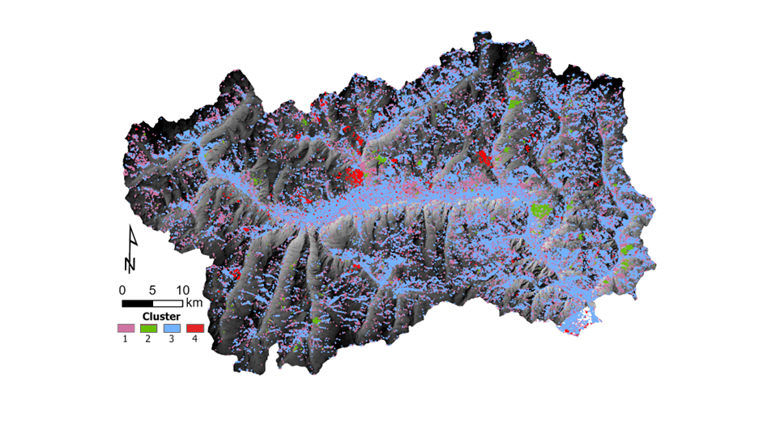
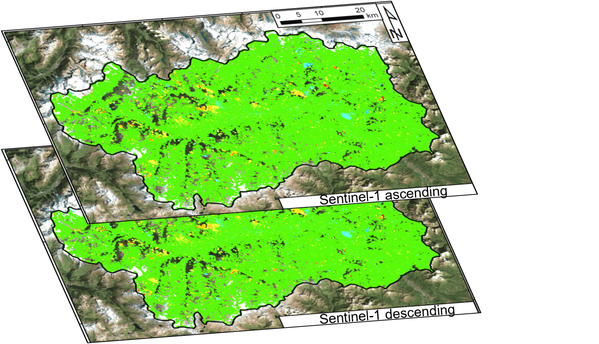
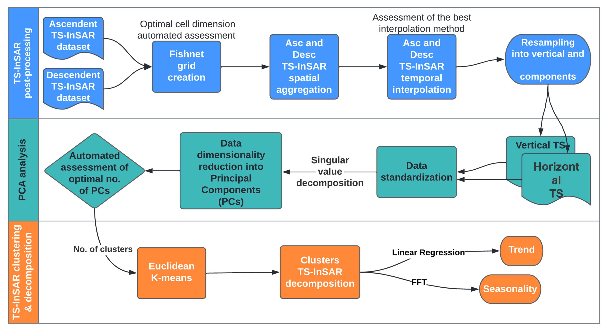
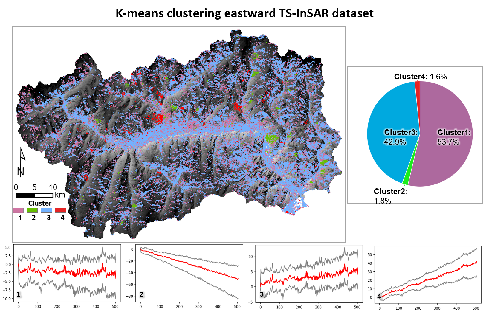
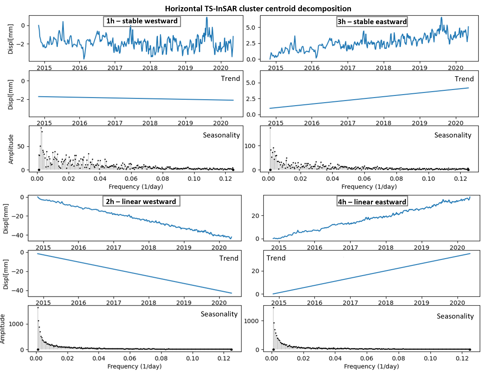

# InSAR-Time-Series-Clustering
First version of the code linked to the November submission to International Journal of Applied Earth Observation and Geoinformation.

Automated and unsupervised approach based on Principal Component Analysis (PCA), K-means clustering, Linear regression and Fast Fourier Transform to detect and analyze patterns of ground deformation from InSAR Time Series.

## Table of contents
- [Input Data](#input-data)
- [Rationale of procedure](#rationale-of-procedure)
- [Output](#output)
- [Acknowledgment](#acknowledgment)

## Input Data
Overlapping LOS InSAR Time Series from ascending and descending geometry of acquisition in CSV format.

## Rationale of procedure

(1) Spatial and temporal post-processing of the PSI dataset to retrieve newly interpolated vertical and horizontal displacement TS-InSAR; (2) PCA-based dimensionality reduction and features retrieval; (3) Unsupervised K-Means learning for TS-InSAR automated clustering and decomposition of the cluster centroids. 

## Output
InSAR features classified according to the K-mean clustering analysis, where the relative clusters series are represented through the 10th, 90th percentile (grey series) and the series centroid (red series).

TS-InSAR cluster centroid decomposition into trend (Linear Regression) and seasonality (power spectrum) components.

## Acknowledgment
There is no restriction about the research/commercial/scientific use of this script. 
Please acknowledge the following work: 

Festa, D., Novellino, A., Hussain, E., Bateson, L., Casagli, N., Confuorto, P., Del Soldato, M., Raspini, F.: Unsupervised detection of InSAR ground motion patterns based on PCA and K-means analysis, International Journal of Applied Earth Observation and Geoinformation, Volume 118, 2023, 103276, ISSN 1569-8432, https://doi.org/10.1016/j.jag.2023.103276.

