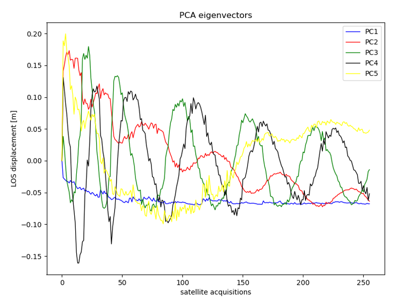

# InSAR-Time-Series-Clustering
First version of the code linked to the October submission to Internal Journal of Applied Earth Observation and Geoinformation

# 1.Dataset
Statical-based rationale for the InSAR Time Series K-means clustering based on Principal Component Analysis (PCA) dimensionality reduction.

# Descrivi i 3 blocchi della procedura.
# 2.grid
